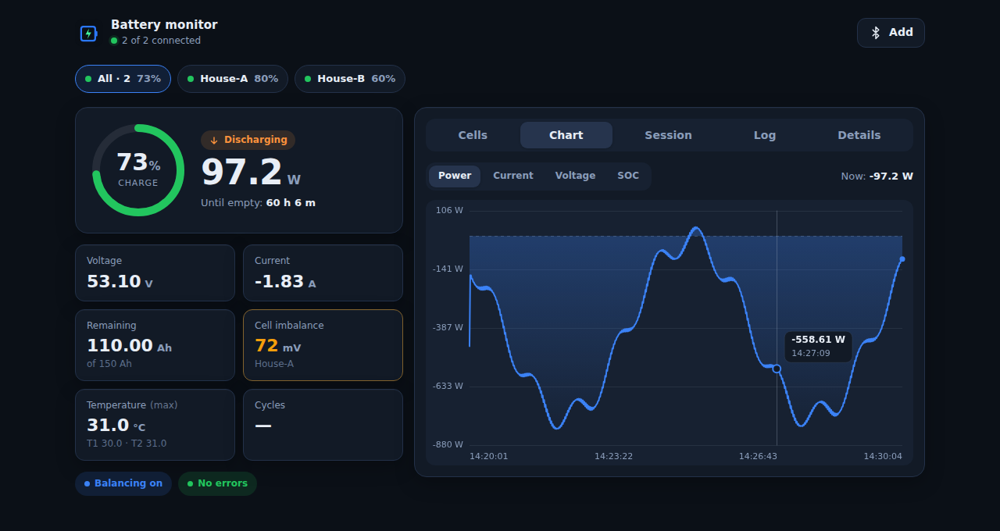
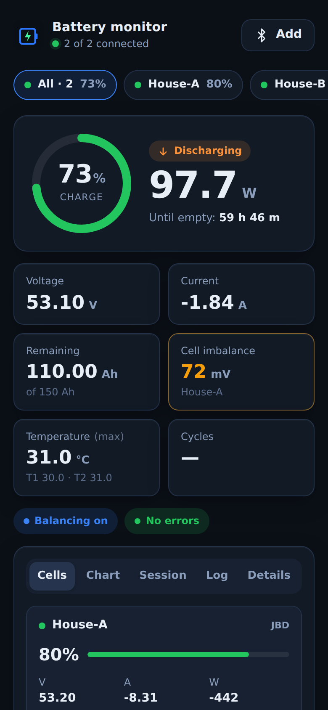
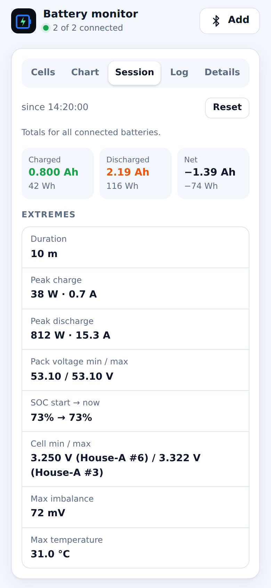
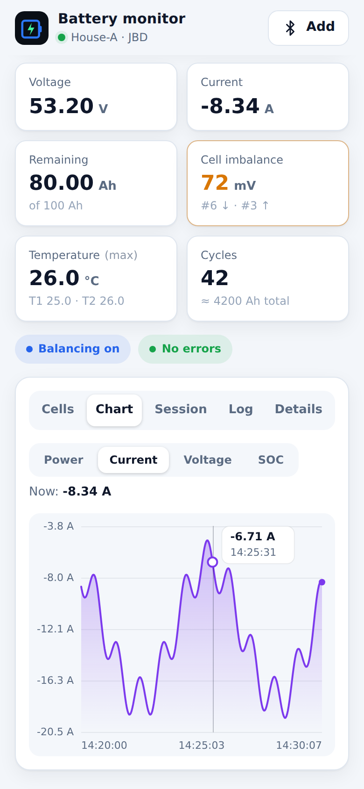
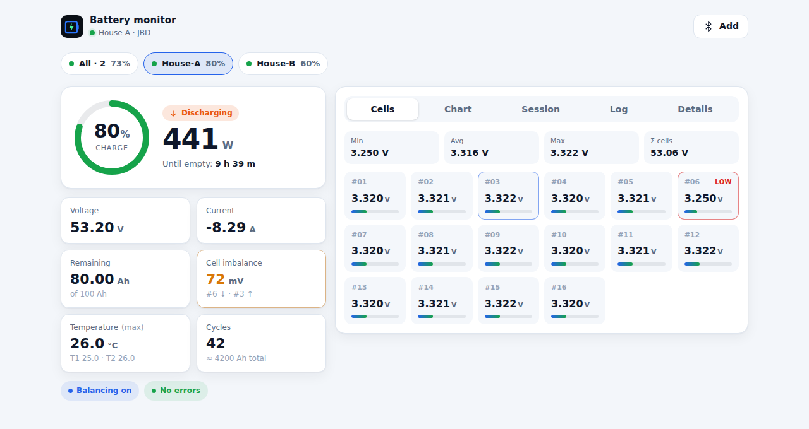
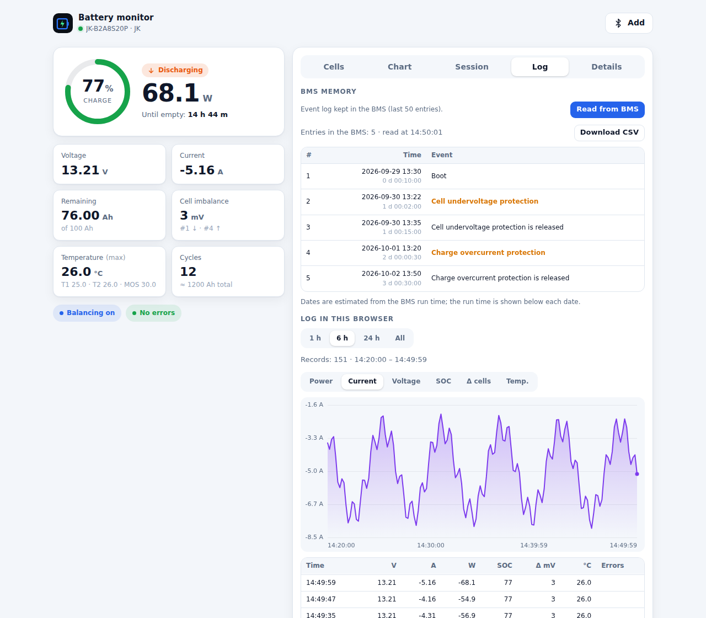

<h1 align="center">
  <br>
  web-bms
</h1>

<p align="center">
  Battery monitor for <b>JK</b> and <b>JBD</b> (Xiaoxiang) BMS over <b>Web Bluetooth</b> — a static web page, no app to install.
</p>

<p align="center">
  <a href="https://antondziuin.github.io/web-bms/"><b>Open the app →</b></a>
  &nbsp;·&nbsp;
  <b>English</b> · <a href="README.ru.md">Русский</a>
</p>

<p align="center">
  <a href="https://github.com/antondziuin/web-bms/actions/workflows/pages.yml"></a>
  <a href="https://github.com/antondziuin/web-bms/actions/workflows/test.yml"></a>
</p>

<p align="center">
  
</p>

## Features

- **Live dashboard** — SOC ring, power, charging / discharging / idle, time to full or empty
- **Pack details** — voltage, current, remaining and full capacity, cell imbalance, temperatures (T1 / T2 / MOS), cycles, balancing, BMS errors
- **Cells** — up to 32 cell voltages with a min / avg / max summary; the lowest and highest cells are highlighted
- **Multiple batteries at once** — battery switcher and an “All” view for parallel packs: summed current, power and capacity, capacity-weighted SOC, an overview card per battery; every connected battery reconnects automatically next time
- **Session counters** — charged / discharged (Ah, Wh), net, peak charge and discharge, pack and cell voltage extremes, SOC at start and now, max temperature and imbalance
- **Charts** — power, current, voltage and SOC for the last 1000 samples, with a hover / tap tooltip
- **BMS memory** — reads what the BMS itself stores: the **JK event log** (boots, protections and their release, MOSFET switching — last 50 entries, dated from the BMS run time) and the **JBD protection counters** (short circuit, over/undervoltage, overcurrent, temperature); CSV export
- **Log in the browser** — records every battery at a chosen interval (5 s – 1 min) and keeps 7 days on the device; view it on the page as a chart and a table, download CSV (Excel) or JSON, open a saved file later; optional raw BLE frame capture for troubleshooting
- **Works offline** (opt-in) — the app offers to save itself on the device, then opens without a network and can be installed to the home screen
- **Reliable link** — automatic reconnection when the Bluetooth link drops; optional “keep screen on”
- **Light and dark themes**, responsive layout from 320 px phones to desktops
- **English, Russian and Ukrainian** UI, picked from the browser language (can be changed in *Details*)

## Screenshots

<table>
  <tr>
    <td align="center" width="33%"><br><sub>All batteries</sub></td>
    <td align="center" width="33%"><br><sub>Session counters</sub></td>
    <td align="center" width="33%"><br><sub>Current chart</sub></td>
  </tr>
</table>

<table>
  <tr>
    <td align="center" width="50%"><br><sub>One battery, light theme</sub></td>
    <td align="center" width="50%"><br><sub>BMS event log and the browser log</sub></td>
  </tr>
</table>

## Getting started

1. Open **https://antondziuin.github.io/web-bms/** in **Chrome** or **Edge** (desktop or Android).
2. Press **Connect** → **Choose device…** and pick your BMS in the system dialog. If a PIN is requested, it is usually `123456`.
3. To watch several packs, press **Add** and pick the next BMS; the **All** chip shows them combined.
4. To use the app without internet, accept the **Work offline** suggestion (or turn it on later in *Details → Settings*).
5. **Log** tab: **Read from BMS** shows the log / counters stored in the BMS; below is the log this browser records while a BMS is connected.

Firefox and Safari do not support Web Bluetooth; on iOS the [Bluefy](https://apps.apple.com/app/bluefy-web-ble-browser/id1492822055) browser can be used. Web Bluetooth needs HTTPS or `http://localhost`.

## Development

```sh
npm install
npm start          # http://localhost:8080
```

### Tests

```sh
npm test           # ESLint + unit tests + browser tests
npm run test:unit  # JK/JBD protocols, model, session counters, dictionaries (node:test)
npm run test:e2e   # the app in headless Chromium with a Bluetooth mock (Playwright)
```

- The browser tests replace `navigator.bluetooth` with an emulator that sends byte-accurate JBD and JK frames (`tests/fixtures/frames.mjs`) and cover connecting, displayed values, multiple batteries, sessions, reconnection, localization and offline mode.
- A **layout test** opens every view at 320, 390, 768 and 1280 px in all three languages and fails if any text spills out of its container, gets cut off, or makes the page scroll sideways.
- Before the first run on your machine: `npx playwright install chromium`.
- GitHub Actions runs the tests on every pull request, and GitHub Pages is deployed only after they pass.

### Screenshots

`npm run screenshots` regenerates `docs/screenshots/` from the Bluetooth emulator with a simulated clock, so the images are reproducible.

### Project layout

| File | Purpose |
| --- | --- |
| `index.html`, `css/styles.css` | markup and styles |
| `js/protocols.js` | JK / JBD frame parsing (no DOM, unit-tested) |
| `js/ble.js` | BLE drivers on top of GATT |
| `js/model.js`, `js/session.js` | battery state, multi-battery aggregate, session counters |
| `js/chart.js`, `js/i18n.js`, `js/offline.js` | chart, translations, offline mode |
| `js/bmsmemory.js` | JK event log / JBD protection counters read from the BMS |
| `js/log.js`, `js/logformat.js`, `js/logstore.js` | browser log: recording (IndexedDB), viewer, CSV / JSON |
| `js/app.js` | battery manager and UI |
| `sw.js` | service worker (registered only after the user opts in) |
| `tests/` | unit, browser and layout tests, Bluetooth emulator, screenshot script |

### Credits

The JK event-log command (`0xA1`), its frame layout and event names follow
[syssi/esphome-jk-bms](https://github.com/syssi/esphome-jk-bms) (Apache-2.0). The JBD protection counters
(register `0xAA`) follow the published JBD BMS communication protocol.

### Deploying

`.github/workflows/pages.yml` runs the tests and deploys to GitHub Pages on every push to `main` (or manually: *Actions → Deploy to GitHub Pages → Run workflow*). Pages has to be enabled once: **Settings → Pages → Build and deployment → Source: GitHub Actions**.
