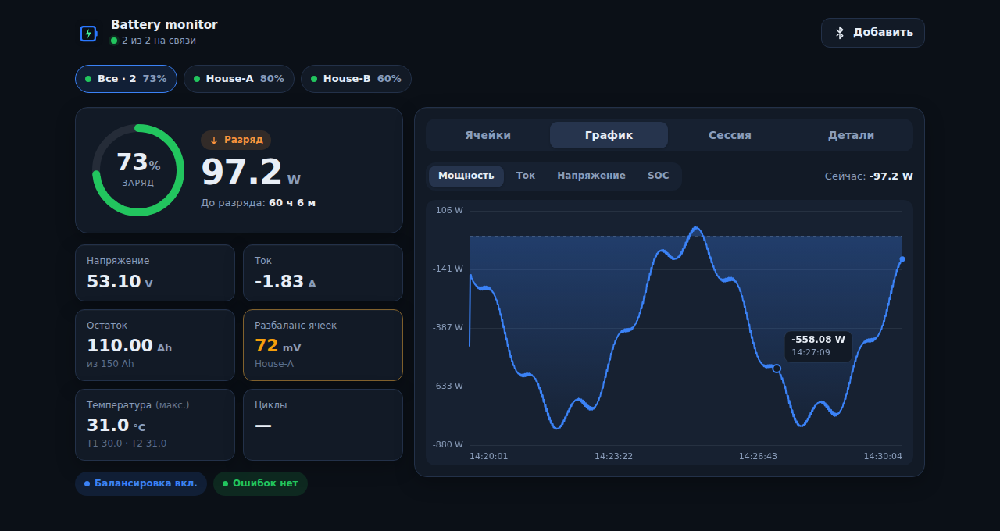
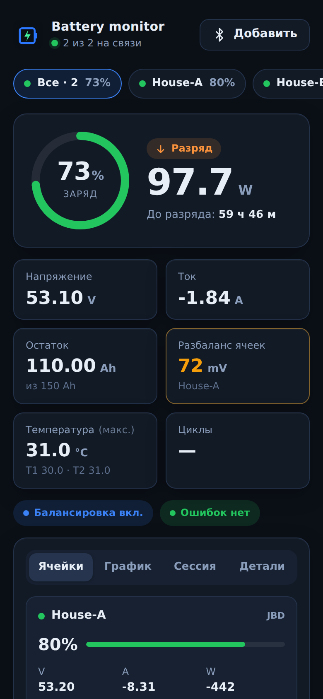
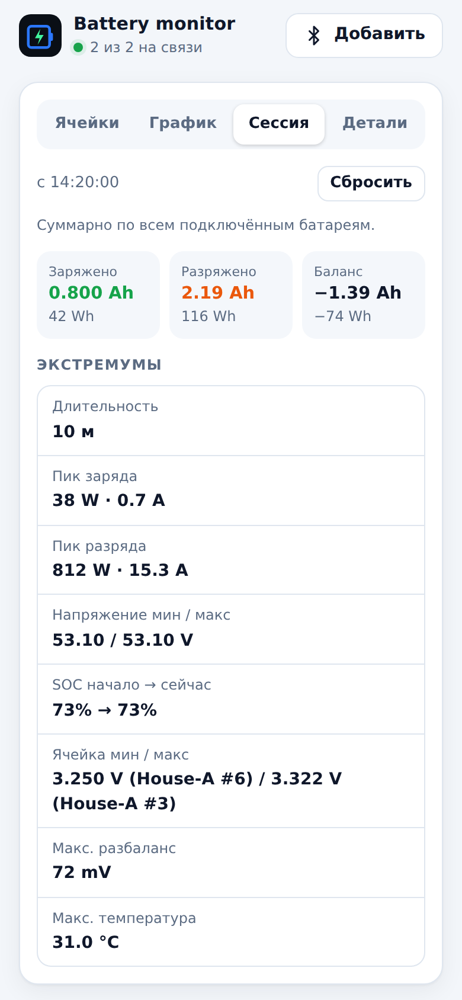
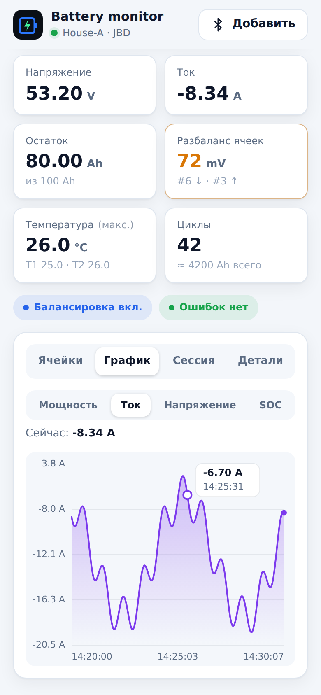
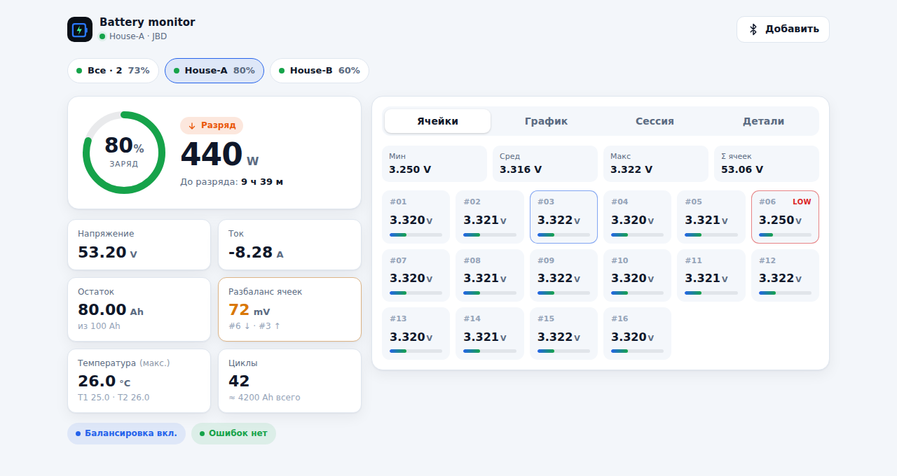

<h1 align="center">
  <br>
  web-bms
</h1>

<p align="center">
  Монитор аккумулятора для BMS <b>JK</b> и <b>JBD</b> (Xiaoxiang) через <b>Web Bluetooth</b> — обычная веб-страница, ничего устанавливать не нужно.
</p>

<p align="center">
  <a href="https://antondziuin.github.io/web-bms/"><b>Открыть приложение →</b></a>
  &nbsp;·&nbsp;
  <a href="README.md">English</a> · <b>Русский</b>
</p>

<p align="center">
  <a href="https://github.com/antondziuin/web-bms/actions/workflows/pages.yml"></a>
  <a href="https://github.com/antondziuin/web-bms/actions/workflows/test.yml"></a>
</p>

<p align="center">
  
</p>

## Возможности

- **Панель в реальном времени** — кольцевой индикатор SOC, мощность, заряд / разряд / ожидание, время до заряда или разряда
- **Данные пакета** — напряжение, ток, остаток и полная ёмкость, разбаланс ячеек, температуры (T1 / T2 / MOS), циклы, балансировка, ошибки BMS
- **Ячейки** — напряжения до 32 ячеек со сводкой мин / сред / макс, самая низкая и самая высокая ячейка подсвечены
- **Несколько батарей одновременно** — переключатель батарей и режим «Все» для параллельных банков: суммарный ток, мощность и ёмкость, средневзвешенный SOC, карточка каждой батареи; все подключённые батареи сами подключаются при следующем открытии
- **Счётчики сессии** — заряжено / разряжено (Ah, Wh), баланс, пики заряда и разряда, экстремумы напряжения пакета и ячеек, SOC в начале и сейчас, макс. температура и разбаланс
- **Графики** — мощность, ток, напряжение и SOC за последние 1000 замеров, подсказка по наведению / касанию
- **Работа без интернета** (по желанию) — приложение предлагает сохранить себя на устройстве, потом открывается без сети и устанавливается на главный экран
- **Надёжная связь** — автоматическое переподключение при обрыве Bluetooth; режим «не гасить экран»
- **Светлая и тёмная тема**, адаптивная вёрстка от телефонов шириной 320 px до десктопа
- **Английский, русский и украинский** интерфейс — по языку браузера (меняется во вкладке «Детали»)

## Скриншоты

<table>
  <tr>
    <td align="center" width="33%"><br><sub>Все батареи</sub></td>
    <td align="center" width="33%"><br><sub>Счётчики сессии</sub></td>
    <td align="center" width="33%"><br><sub>График тока</sub></td>
  </tr>
</table>

<p align="center">
  <br>
  <sub>Одна батарея, светлая тема</sub>
</p>

## Как начать

1. Откройте **https://antondziuin.github.io/web-bms/** в **Chrome** или **Edge** (компьютер или Android).
2. Нажмите **Подключить** → **Выбрать устройство…** и выберите BMS в системном окне. Если спросят PIN, обычно это `123456`.
3. Чтобы смотреть несколько батарей, нажмите **Добавить** и выберите следующую BMS; чип **Все** показывает их вместе.
4. Чтобы пользоваться приложением без интернета, примите предложение **Работа без интернета** (или включите позже: *Детали → Настройки*).

Firefox и Safari не поддерживают Web Bluetooth; на iOS можно использовать браузер [Bluefy](https://apps.apple.com/app/bluefy-web-ble-browser/id1492822055). Web Bluetooth работает только по HTTPS или на `http://localhost`.

## Разработка

```sh
npm install
npm start          # http://localhost:8080
```

### Тесты

```sh
npm test           # ESLint + юнит-тесты + браузерные тесты
npm run test:unit  # протоколы JK/JBD, модель, счётчики сессии, словари (node:test)
npm run test:e2e   # приложение в headless Chromium с имитацией Bluetooth (Playwright)
```

- Браузерные тесты подменяют `navigator.bluetooth` эмулятором, который отдаёт побайтно точные кадры JBD и JK (`tests/fixtures/frames.mjs`), и проверяют подключение, значения, несколько батарей, сессию, переподключение, локализацию и работу без интернета.
- **Тест вёрстки** открывает все экраны на ширине 320, 390, 768 и 1280 px на всех трёх языках и падает, если текст вылезает за свой контейнер, обрезается или страница прокручивается вбок.
- Перед первым запуском на своей машине: `npx playwright install chromium`.
- Тесты запускаются в GitHub Actions на каждый пулл-реквест, а публикация на Pages выполняется только после их успешного прохождения.

### Скриншоты

`npm run screenshots` пересоздаёт `docs/screenshots/` на эмуляторе Bluetooth с имитацией времени, поэтому картинки воспроизводимы.

### Структура

| Файл | Назначение |
| --- | --- |
| `index.html`, `css/styles.css` | разметка и стили |
| `js/protocols.js` | разбор кадров JK / JBD (без DOM, покрыт юнит-тестами) |
| `js/ble.js` | драйверы BLE поверх GATT |
| `js/model.js`, `js/session.js` | состояние батареи, сумма по батареям, счётчики сессии |
| `js/chart.js`, `js/i18n.js`, `js/offline.js` | график, переводы, работа без интернета |
| `js/app.js` | менеджер батарей и интерфейс |
| `sw.js` | service worker (включается только по согласию пользователя) |
| `tests/` | юнит-, браузерные тесты и тест вёрстки, эмулятор Bluetooth, скрипт скриншотов |

### Публикация

`.github/workflows/pages.yml` запускает тесты и публикует сайт на GitHub Pages при каждом push в `main` (или вручную: *Actions → Deploy to GitHub Pages → Run workflow*). Один раз нужно включить Pages: **Settings → Pages → Build and deployment → Source: GitHub Actions**.
